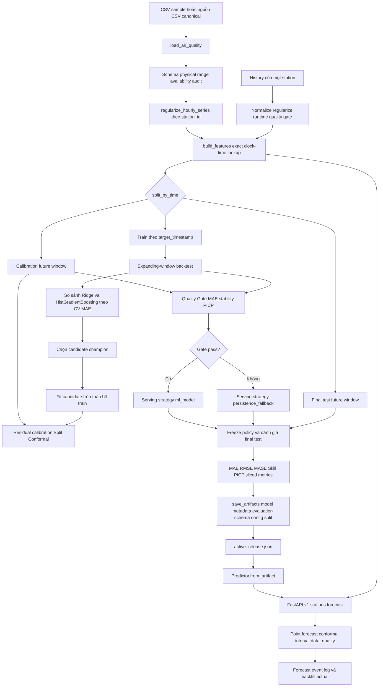

# HCMC PM2.5 Forecasting Platform

Leakage-safe next-hour air-quality forecasting with temporal backtesting, uncertainty calibration and production guardrails.

[](https://www.python.org/)
[](https://github.com/haminhthong/HCMC-Pm25-Forecasting/actions/workflows/ci.yml)
[](https://fastapi.tiangolo.com/)
[](https://streamlit.io/)
[](https://docs.docker.com/compose/)
[](LICENSE)

> **Trạng thái hiện tại:** đây là một prototype kiểm định hệ thống trên `data/sample/air_quality_sample.csv`. Kết quả trong README chỉ chứng minh pipeline chạy đúng trên dữ liệu mẫu; không được diễn giải thành hiệu năng đại diện cho toàn bộ chất lượng không khí TP.HCM.

## 1. Bài toán & phạm vi ứng dụng

Tại thời điểm dự báo `t`, hệ thống sử dụng dữ liệu đã thực sự có sẵn của **một trạm** để dự báo PM2.5 tại `t + 1 giờ`:

```text
Quan trắc đã phát hành đến t  ──>  Đặc trưng nhân quả tại t  ──>  PM2.5(t+1)
```

Mục tiêu kỹ thuật của repo là kiểm soát toàn bộ đường đi của dữ liệu:

- Chuẩn hóa timestamp về UTC; chỉ dùng múi giờ TP.HCM cho các đặc trưng lịch.
- Tra lag theo đúng mốc đồng hồ `(station_id, timestamp - offset)`, không dùng `shift()` theo vị trí dòng.
- Tách train, calibration và final test theo thời gian; target ở tương lai không được vượt qua biên split.
- Chọn model bằng expanding-window backtest, hiệu chuẩn khoảng dự báo bằng Split Conformal và có fallback về Persistence khi runtime history không đạt hợp đồng chất lượng.
- Đóng gói model cùng config, feature schema, metadata và split manifest để serving không phụ thuộc nhầm vào file cấu hình đang sửa trong working tree.

### Đã triển khai trong mã nguồn

| Nhóm | Thành phần đang chạy |
|---|---|
| Ingestion | Đọc CSV mẫu, alias `station` sang `station_id`, chuẩn hóa timestamp và `available_at` |
| Data quality | Kiểm tra schema, miền giá trị, duplicate, missingness, gap và availability |
| Regularization | Chèn dòng `NaN` trên lưới 1 giờ cho từng trạm |
| Feature engine | Lag clock-time, rolling causal, delta, cyclic time, exogenous availability |
| Forecasting | Persistence, Seasonal-24h, Ridge, HistGradientBoosting |
| Evaluation | Expanding-window backtest, calibration độc lập, final test và sliced metrics |
| Uncertainty | Finite-sample Split Conformal, q90 toàn cục và q90 theo trạm khi đủ mẫu |
| Serving | FastAPI, artifact versioning, runtime quality gate, persistence fallback |
| Monitoring | Forecast event log và hàm backfill actual/performance metrics |

### Chưa phải production pipeline

Các hạng mục sau là roadmap, chưa được coi là kiến trúc canonical của repo:

- Kết nối station API thật theo lịch và cơ chế retry/rate-limit.
- Kho lưu trữ incremental cho dữ liệu raw/canonical và quy trình backfill.
- Xử lý late-arriving observation, lịch chạy tự động và orchestration.
- Data-quality dashboard, alerting và model registry bên ngoài artifact directory.
- Đánh giá trên dữ liệu quan trắc đủ dài để kết luận hiệu năng theo thành phố.

## 2. Kết quả kiểm định hiện tại

Bảng dưới đây lấy từ `evaluation.json` của version đang được trỏ bởi `artifacts/active_release.json`; kết quả hiện tại dùng split `52 train / 6 calibration / 8 test` trên sample dataset.

### 2.1 So sánh trên final test

| Model / strategy | MAE | RMSE | MASE | Skill vs Persistence | Vai trò |
|---|---:|---:|---:|---:|---|
| Persistence | 0.250 | 0.292 | 1.000 | 0.0% | Baseline |
| Seasonal Naive 24h | 5.948 | 5.952 | 23.790 | -2279.0% | Baseline |
| Ridge | 0.316 | 0.317 | 1.264 | -26.4% | Candidate và serving champion của artifact hiện tại |

Model `Ridge` được chọn theo CV và quality gate trong artifact mẫu, nhưng **không vượt Persistence trên final test nhỏ**. Đây là lý do kết quả chỉ dùng để kiểm tra luồng kỹ thuật, không dùng làm tuyên bố chất lượng mô hình.

### 2.2 Backtest ứng viên

| Candidate | CV MAE trung bình | CV MAE std | CV RMSE trung bình |
|---|---:|---:|---:|
| Ridge | 0.380 | 0.110 | 0.400 |
| HistGradientBoosting | 4.110 | 0.550 | 4.740 |

### 2.3 Uncertainty

| Chỉ số | Kết quả |
|---|---:|
| Target coverage | 90% |
| Actual PICP trên final test | 75% |
| Mean interval width | 0.655 µg/m³ |
| Quality gate | `đạt` theo calibration gate |

PICP 75% được báo cáo trung thực vì final test chỉ có 8 dòng. Recall nhóm PM2.5 cao là diagnostic; không còn là điều kiện bắt buộc để cho phép model regression qua gate.

## 3. Data contract và chính sách chống leakage

### 3.1 Hợp đồng trường dữ liệu

| Trường | Có sẵn tại | Vai trò | Quy tắc |
|---|---|---|---|
| `timestamp` | Origin `t` | Khóa thời gian | Timestamp không timezone được hiểu là `Asia/Ho_Chi_Minh`, sau đó lưu UTC |
| `station_id` | `t` | Khóa chuỗi | Mỗi request chỉ chứa một trạm |
| `PM2.5(t)` | `t` | Feature hiện tại | Hợp lệ nếu đã được phát hành tại origin |
| `PM2.5(t+1)` | Tương lai | Target | Chỉ dùng làm nhãn train/evaluation, không đi vào feature tại `t` |
| `temperature(t)`, `humidity(t)` | `t` | Exogenous observed | Chỉ dùng nếu có tại origin |
| `NO2(t)`, `SO2(t)`, `CO(t)`, `O3(t)` | `t` | Exogenous observed | Tra theo exact clock-time và availability |
| Weather `(t+1)` | Tương lai | Prohibited by default | Chỉ được dùng nếu đến từ một nguồn forecast/NWP có contract riêng |
| `available_at` | Metadata phát hành | Availability contract | Quan trắc chỉ hợp lệ khi `available_at <= origin` |

### 3.2 Chính sách missing và gap

| Tình huống | Xử lý canonical |
|---|---|
| Trùng `(station_id, timestamp)` | Audit ghi nhận; feature lookup từ chối để không chọn ngầm một bản ghi |
| Thiếu một giờ | `regularize_hourly_series()` chèn dòng `NaN`; exact lookup trả `NaN`, sau đó imputer dùng cùng logic train/serve |
| Late observation | Nếu `available_at > origin` thì bị xem là chưa có và không được làm feature |
| Out-of-order event | Loader chuẩn hóa timestamp; regularizer sort theo trạm và thời gian |
| Station outage / gap lớn | Runtime gate trả `DEGRADED`; nếu gap vượt `allowed_gap_hours=6` thì dùng Persistence fallback |
| Thiếu lịch sử tối thiểu | Dưới 25 giờ là `UNUSABLE`; API trả lỗi thay vì dự báo không an toàn |
| PM2.5 hiện tại bị thiếu | Không thể dự báo Persistence hoặc tạo origin hợp lệ; request bị từ chối |

## 4. Luồng logic, luồng dữ liệu và quy trình kỹ thuật canonical

> Sơ đồ dưới đây là quy trình duy nhất được dùng để đối chiếu code, config, artifact và báo cáo. Nó chỉ vẽ những thành phần hiện có trong repo; không đưa Kafka, Airflow hay database chưa triển khai vào kiến trúc thực thi.



### 4.1 Diễn giải luồng offline

1. `load_air_quality()` đọc CSV theo `configs/config.yaml`, đổi alias legacy và đưa timestamp về UTC.
2. `audit_air_quality()` tạo báo cáo chất lượng; `regularize_hourly_series()` làm rõ các giờ bị thiếu bằng dòng `NaN`.
3. `build_features()` tạo feature từ hiện tại/quá khứ. Rolling dùng `closed="left"`; label `target_next_hour` được lookup riêng tại `t+1`.
4. `split_by_time()` tạo train, calibration và final test. Nếu có calendar boundary thì boundary cố định được ưu tiên hơn fraction.
5. `evaluate_candidate()` chạy expanding-window folds. Candidate có CV MAE thấp nhất trở thành candidate champion.
6. Candidate được fit lại trên train; calibration window độc lập tạo residual quantile cho interval và cung cấp input cho Quality Gate.
7. Chính sách serving được freeze trước khi đọc final test. Artifact ghi lại cả candidate và serving champion để không nhầm “model tốt nhất” với “policy thực sự phục vụ”.

### 4.2 Diễn giải luồng online

1. Artifact loader đọc `active_release.json`, sau đó nạp bundle versioned gồm model, metadata, schema và config snapshot.
2. Endpoint chính lấy lịch sử trạm từ `data.path` đang cấu hình. Đây là CSV backend hiện tại, chưa phải database streaming.
3. Predictor chuẩn hóa timestamp, regularize, kiểm tra đủ 25 giờ và chạy runtime gate.
4. Nếu history hợp lệ, predictor gọi cùng feature engine như offline; nếu gap vượt policy, predictor trả Persistence fallback.
5. Response trả điểm dự báo, interval, `serving_champion`, `production_readiness`, `calibration_gate` và `data_quality`.

## 5. Giao thức mô hình và đánh giá

Các baseline và công thức được tách khỏi README tại [docs/FORECASTING_PROTOCOL.md](docs/FORECASTING_PROTOCOL.md). README chỉ giữ quy tắc vận hành:

- Persistence và Seasonal Naive 24h luôn là baseline bắt buộc.
- Candidate hiện bật trong config là `ridge` và `hist_gradient_boosting`.
- Model selection dùng mean CV MAE trên expanding windows; không dùng final test để chọn model.
- Calibration chỉ dùng future calibration window độc lập, không fallback sang train/test khi calibration rỗng.
- Quality Gate chính kiểm tra MAE improvement so với Persistence, độ ổn định CV và PICP nếu đã tính. Recall PM2.5 cao được lưu để chẩn đoán nghiệp vụ.
- `production_readiness=smoke_test_only` khi dữ liệu đến từ `data/sample` hoặc synthetic; cờ này không được bỏ qua khi triển khai.

## 6. Cấu trúc thư mục dự án

```text
hcmc-pm25-forecasting/
├── app/
│   ├── api.py                         # FastAPI: health, raw debug, forecast theo trạm
│   └── dashboard.py                   # Streamlit dashboard
├── configs/
│   └── config.yaml                    # Data, feature, split, model và artifact contract
├── .github/workflows/ci.yml            # pip check, Ruff, pytest và smoke training
├── data/
│   ├── sample/air_quality_sample.csv  # Smoke dataset đã commit
│   └── README.md                      # Data card và provenance
├── docs/
│   ├── FORECASTING_PROTOCOL.md        # Công thức baseline, split và conformal
│   └── MODEL_CARD.md                  # Mô tả model card
├── notebooks/                         # Notebook kiểm tra / minh họa
├── reports/                           # Output sinh từ evaluation artifact, không phải source
├── src/
│   ├── artifacts/                     # Writer, loader, schema, release pointer
│   ├── calibration/                   # Split Conformal
│   ├── data/                          # Loader, schema, quality, regularization, sources
│   ├── evaluation/                    # Metrics và sliced error analysis
│   ├── features/                      # Lag, rolling, temporal, exogenous, builder
│   ├── forecasting/                   # Baselines, model factory, selector, trainer
│   ├── monitoring/                    # Forecast log và performance metrics
│   ├── serving/                       # Predictor runtime
│   ├── validation/                    # Temporal split và backtest
│   ├── pipeline.py                    # Entry point offline canonical
│   └── train.py                       # Facade CLI tương thích ngược
├── tests/                             # Unit, contract và compliance tests
├── scripts/
│   └── build_improvement_report.py     # Tùy chọn: sinh báo cáo DOCX audit
├── artifacts/                         # Sinh khi train; nên lưu ngoài Git nếu lớn
├── Dockerfile
├── docker-compose.yml
├── requirements.txt
└── requirements-dev.txt
```

## 7. Hướng dẫn cài đặt

Source được chia theo trách nhiệm trong `src/data`, `src/features`, `src/forecasting`,
`src/validation`, `src/calibration`, `src/artifacts`, `src/serving` và `src/monitoring`.
`src/features/__init__.py` là điểm export duy nhất cho feature engine. Các facade
`src/train.py`, `src/predict.py`, `src/models.py`, `src/evaluate.py` giữ tương thích import/CLI cũ.

Dependency cài đặt nằm trong `requirements.txt`; công cụ kiểm thử/notebook nằm trong
`requirements-dev.txt`. `requirements.lock` dành cho Docker và `requirements-colab.txt`
dành cho notebook tái lập. Không duy trì thêm bản `.in` trùng lặp.
`.dockerignore` loại cache, Git history, notebook, secret và artifact cục bộ khỏi build context;
Docker Compose tạo model qua service `train` và chia sẻ bằng volume `artifacts`.

### Windows PowerShell

```powershell
python -m venv .venv
.\.venv\Scripts\Activate.ps1
python -m pip install --upgrade pip
python -m pip install -r requirements-dev.txt
```

### Linux/macOS

```bash
python3 -m venv .venv
source .venv/bin/activate
python -m pip install --upgrade pip
python -m pip install -r requirements-dev.txt
```

Kiểm tra đường dẫn dữ liệu trong `configs/config.yaml`. Mặc định repo dùng:

```yaml
data:
  path: data/sample/air_quality_sample.csv
  station_column: station_id
  target_column: PM2.5
```

CSV tối thiểu phải có `timestamp`, `station_id` và `PM2.5`. Timestamp không timezone được hiểu là giờ TP.HCM; sau khi load sẽ được lưu dưới dạng UTC.

## 8. Hướng dẫn chạy kiểm thử và huấn luyện

### Chạy lint và test

```bash
python -m pip check
python -m ruff check src app tests
python -m pytest -q
```

CI GitHub Actions chạy các bước trên trên Python 3.10 và 3.11, sau đó thêm smoke training
với `--no-artifacts` để xác nhận pipeline không ghi artifact ngoài ý muốn trong quá trình kiểm thử.

### Chạy pipeline an toàn, không ghi artifact

```bash
python -m src.train --config configs/config.yaml --no-artifacts
```

### Huấn luyện và đóng gói release

```bash
python -m src.train --config configs/config.yaml
```

Sau khi chạy thành công, artifact chính nằm tại:

```text
artifacts/models/<model_version>/
├── model.joblib
├── metadata.json
├── evaluation.json
├── feature_schema.json
├── config_snapshot.yaml
└── split_manifest.json
```

`artifacts/active_release.json` trỏ tới version đang phục vụ và được loader ưu tiên trước flat legacy mirror; `production.json` vẫn được ghi để tương thích bundle cũ. Không sửa trực tiếp model trong thư mục versioned.

### Sinh báo cáo đánh giá

```bash
python -m src.report
```

Lệnh ưu tiên `evaluation.json` của version được trỏ bởi `artifacts/active_release.json`; nếu pointer chưa có thì mới dùng artifact phẳng tương thích và ghi `reports/evaluation_summary.md`.

## 9. Chạy API và dashboard

### FastAPI

```bash
uvicorn app.api:app --reload --port 8000
```

- Swagger: [http://localhost:8000/docs](http://localhost:8000/docs)
- Health: `GET /health`
- API chính: `GET /v1/stations/{station_id}/forecast`
- API raw debug: `POST /v1/predict/raw`
- Alias tương thích: `POST /predict`

API chính hiện đọc history từ CSV theo `data.path`, lấy tối đa 168 dòng của station rồi đưa vào Predictor. Nó chưa đọc trực tiếp từ database hoặc stream.

Ví dụ response rút gọn:

```json
{
  "station": "Trạm A",
  "station_id": "Trạm A",
  "forecast_origin": "2024-01-02 10:00:00+00:00",
  "forecast_for": "2024-01-02 11:00:00+00:00",
  "current_pm25": 32.1,
  "predicted_pm25": 32.4,
  "forecast_strategy": "ml_model",
  "serving_champion": "ridge",
  "interval": {
    "method": "split_conformal_prediction_interval",
    "coverage_target": 0.9,
    "lower": 32.1,
    "upper": 32.7,
    "width": 0.6
  },
  "data_quality": {
    "status": "GOOD",
    "fallback_required": false
  }
}
```

### Streamlit

```bash
streamlit run app/dashboard.py
```

### Docker Compose

```bash
docker compose up --build
```

## 10. Artifact, báo cáo và quan sát sau triển khai

- `metadata.json`: model version, champion, readiness, feature list, data provenance và conformal q90.
- `evaluation.json`: backtest, calibration, final test, quality gate và sliced metrics.
- `feature_schema.json`: thứ tự feature mà pipeline phải nhận khi serving.
- `config_snapshot.yaml`: config đúng tại thời điểm train.
- `split_manifest.json`: khoảng thời gian và số dòng của train/calibration/test.
- `src/monitoring/forecast_log.py`: ghi event dự báo và backfill actual theo `(station_id, forecast_for)`.
- `src/monitoring/performance.py`: tính rolling MAE, bias, skill, PICP và fallback rate khi event đã mature.

## 11. Giới hạn và hướng phát triển

1. Thay sample CSV bằng connector dữ liệu thật, lưu raw snapshot bất biến và kiểm soát checksum.
2. Bổ sung incremental ingestion, retry, late-arriving data và lịch chạy tự động.
3. Tích lũy calibration window đủ dài để đánh giá q90 theo trạm có ý nghĩa thống kê.
4. Mở rộng multi-horizon forecast sau khi single-step contract ổn định.
5. Thêm monitoring production cho data drift, coverage drift, latency và tỷ lệ fallback.

## 12. Giấy phép

Phát hành theo [MIT License](LICENSE).
