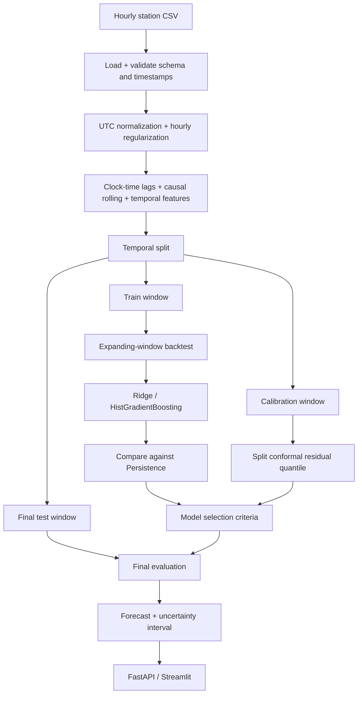

# HCMC PM2.5 Next-Hour Forecasting Prototype

Leakage-safe next-hour PM2.5 forecasting with temporal backtesting and conformal uncertainty intervals.

[](https://github.com/haminhthong/hcmc-pm25-forecasting/actions/workflows/ci.yml)
[](https://www.python.org/)
[](https://fastapi.tiangolo.com/)
[](LICENSE)

## Bài toán và phạm vi ứng dụng

Dự án nhận history PM2.5 theo từng trạm và dự báo giá trị của giờ kế tiếp. Mục tiêu chính là minh họa một quy trình time-series có thể kiểm tra được:

- mọi timestamp được đưa về UTC;
- dữ liệu được regularize về lưới một giờ trước khi tạo feature;
- lag được tra theo clock time thay vì `shift()` theo vị trí dòng;
- feature chỉ dùng dữ liệu đã có tại forecast origin;
- train, calibration và final test được chia theo thời gian;
- model ML luôn được so với Persistence và Seasonal Naive 24h;
- calibration set riêng tạo conformal prediction interval;
- history runtime không đủ tốt sẽ dùng Persistence.

Đây là prototype dùng một nguồn CSV lịch sử/sample. Kết quả bên dưới không phải tuyên bố về chất lượng không khí toàn TP.HCM.

## Thành phần đã triển khai và giới hạn hiện tại

| Đã triển khai | Chưa nằm trong V1 / roadmap |
|---|---|
| Đọc CSV và kiểm tra schema | Kết nối station API thật |
| Chuẩn hóa UTC và regularize theo giờ | Incremental storage và backfill |
| Lag theo timestamp, rolling causal, time features | Xử lý late-arriving observation theo lịch chạy |
| Temporal train/calibration/test split | Tự động chạy theo lịch |
| Expanding-window backtest | Theo dõi chất lượng dữ liệu theo từng đợt |
| Ridge, HistGradientBoosting, Persistence, Seasonal Naive 24h | Mở rộng benchmark citywide với dữ liệu lớn |
| Split conformal interval | Hiệu chuẩn lại trên các giai đoạn dài hơn |
| FastAPI và Streamlit demo | |
| CI với Ruff, pytest, pip check và smoke train | |

## Kết quả mẫu hiện tại

Bảng này được lấy từ sample data để kiểm tra hệ thống. Không dùng nó để kết luận model ML tốt hơn trên dữ liệu HCMC thực tế.

| Model / baseline | MAE | RMSE | Vai trò |
|---|---:|---:|---|
| Persistence | 0.250 | 0.292 | Baseline bắt buộc |
| Seasonal Naive 24h | 5.948 | 5.952 | Baseline theo cùng giờ ngày trước |
| Ridge | 0.316 | 0.317 | Ứng viên ML hiện chưa thắng Persistence trên final test |

Sample hiện có khoảng 6 dòng calibration và 8 dòng final test. Conformal interval được triển khai bằng finite-sample split-conformal; PICP quan sát trên final test là 75% so với mục tiêu 90%, vì vậy đây chỉ là minh họa phương pháp, không phải cam kết calibration đáng tin cậy.

| Uncertainty | Target coverage | PICP trên final test | Mean interval width |
|---|---:|---:|---:|
| Split conformal | 90% | 75% | 0.655 µg/m³ |

## Data contract và chống leakage

Mốc `timestamp` là thời điểm quan trắc. `available_at`, nếu có, là thời điểm quan trắc được phát hành; feature chỉ được dùng khi `available_at <= forecast_origin`.

| Field | Available time | Vai trò |
|---|---|---|
| `PM2.5(t)` | `t` | Feature hiện tại |
| `PM2.5(t+1)` | Tương lai | Target, không được dùng làm feature |
| `temperature(t)` | `t` | Feature nếu có |
| `humidity(t)` | `t` | Feature nếu có |
| `weather(t+1)` | Tương lai | Bị cấm, trừ khi có forecast source độc lập |

Lag PM2.5 tại `t-1h`, `t-2h`... được lookup bằng khóa `(station_id, timestamp)`. Vì vậy một dòng trước đó nhưng cách 2 giờ không bị nhận nhầm là lag 1 giờ. Rolling statistics dùng `closed="left"`, chỉ nhìn về quá khứ trước `t`.

## Data quality contract

| Trường hợp | Chính sách |
|---|---|
| Duplicate `(station_id, timestamp)` | Reject ở loader/runtime; không tự chọn một dòng |
| Missing hour | Insert dòng rỗng khi regularize; giữ `NaN` để pipeline impute thống nhất |
| Late observation | Không dùng nếu `available_at` sau forecast origin |
| Out-of-order event | Sort ổn định theo trạm và timestamp trước khi audit/regularize |
| Missing exogenous | Cảnh báo; dùng Persistence để tránh lệch phân phối khi dự báo |
| Station outage hoặc gap lớn | Cảnh báo; dùng Persistence khi vượt `allowed_gap_hours` |
| History dưới 25 giờ hoặc PM2.5 hiện tại thiếu | Không tạo dự báo, trả lỗi input |

## Luồng logic, luồng dữ liệu và pipeline canonical

Đây là flowchart duy nhất chi phối source, cấu hình và báo cáo của dự án:



Quy trình thực thi:

1. `src/data/loader.py` đọc CSV, kiểm tra cột bắt buộc, ép kiểu số và chuẩn hóa `timestamp`/`available_at` về UTC.
2. `src/data/quality.py` audit duplicate, missing, gap, miền giá trị và availability.
3. `src/data/regularization.py` chèn các mốc giờ còn thiếu theo từng trạm.
4. `src/features/builder.py` tạo lag theo clock time, rolling causal, trend, biến thời gian và exogenous features.
5. `src/validation/split.py` tách train → calibration → final test; target timestamp cũng phải nằm trước biên split.
6. `src/validation/backtest.py` chạy expanding-window trên các candidate chỉ trong train window.
7. `src/forecasting/selection.py` chọn `best_cv_model`, sau đó quyết định `forecast_strategy` là model đó hoặc `persistence`.
8. `src/calibration/conformal.py` dùng calibration window riêng để tạo quantile và interval.
9. `src/evaluation` báo cáo baseline, MAE/RMSE/MASE/skill score, PICP và slice theo trạm.
10. `src/inference/input_validation.py` kiểm tra history runtime; gap lớn có thể chuyển chiến lược sang Persistence.
11. `src/inference/predictor.py` dựng feature giống train và trả forecast, mức phân tích, interval và chất lượng input.

## Cấu trúc thư mục

```text
hcmc-pm25-forecasting/
├── app/
│   ├── api.py
│   └── dashboard.py
├── configs/
│   └── config.yaml
├── data/
│   └── sample/
│       └── air_quality_sample.csv
├── src/
│   ├── data/
│   │   ├── loader.py
│   │   ├── schema.py
│   │   ├── quality.py
│   │   └── regularization.py
│   ├── features/
│   │   ├── builder.py
│   │   ├── exogenous.py
│   │   ├── lag.py
│   │   ├── rolling.py
│   │   └── temporal.py
│   ├── forecasting/
│   │   ├── baselines.py
│   │   ├── models.py
│   │   ├── selection.py
│   │   └── trainer.py
│   ├── validation/
│   │   ├── split.py
│   │   └── backtest.py
│   ├── calibration/
│   │   └── conformal.py
│   ├── evaluation/
│   │   ├── metrics.py
│   │   ├── slices.py
│   │   └── station_metrics.py
│   ├── artifacts/
│   │   ├── loader.py
│   │   └── writer.py
│   ├── inference/
│   │   ├── input_validation.py
│   │   └── predictor.py
│   ├── pipeline.py
│   ├── config.py
│   ├── report.py
│   └── utils.py
├── artifacts/
│   ├── model.joblib
│   ├── metadata.json
│   ├── evaluation.json
│   └── feature_schema.json
├── notebooks/
│   ├── 01_experiment.ipynb
│   └── 02_colab_reproducibility.ipynb
├── tests/
├── docs/
│   ├── FORECASTING_PROTOCOL.md
│   └── MODEL_CARD.md
├── Dockerfile
├── requirements.txt
├── requirements-dev.txt
├── requirements-colab.txt
└── README.md
```

`artifacts/` là output cục bộ sau khi train và không cần commit. V1 chỉ giữ một
bộ file kết quả hiện tại để chạy demo.

## Cài đặt

Yêu cầu Python 3.10 trở lên.

```bash
python -m venv .venv
# Linux/macOS
source .venv/bin/activate
# Windows PowerShell
.venv\Scripts\Activate.ps1

python -m pip install --upgrade pip
python -m pip install -r requirements-dev.txt
```

## Kiểm thử và CI

Chạy các lệnh tương đương CI ở local:

```bash
python -m pip check
python -m ruff check src app tests
python -m pytest
python -m src.pipeline train --config configs/config.yaml --no-artifacts
```

GitHub Actions chạy cùng các bước trên với Python 3.10 và 3.11. `--no-artifacts` bảo đảm CI không ghi model vào repository.

## Huấn luyện và tạo bộ file kết quả

```bash
python -m src.pipeline train --config configs/config.yaml
```

Lệnh tạo đúng bốn file hiện tại:

- `artifacts/model.joblib`: pipeline preprocessing + model ứng viên tốt nhất theo CV;
- `artifacts/metadata.json`: `best_cv_model`, `forecast_strategy`, feature columns, interval và provenance;
- `artifacts/evaluation.json`: audit, split summary, backtest, calibration, baseline và final test;
- `artifacts/feature_schema.json`: thứ tự feature dùng khi inference.

Tạo báo cáo Markdown từ evaluation:

```bash
python -m src.report --input artifacts/evaluation.json --output reports/evaluation_summary.md
```

## Chạy API

Huấn luyện trước, sau đó:

```bash
uvicorn app.api:app --reload
```

- `GET /health`: kiểm tra model hiện tại và strategy.
- `POST /predict`: nhận tối thiểu 25 quan trắc của một `station_id`.
- `GET /v1/stations/{station_id}/forecast`: lấy history gần nhất từ CSV sample.

Ví dụ request tối giản:

```json
{
  "observations": [
    {"timestamp": "2024-01-01T00:00:00", "station_id": "A", "PM2.5": 20.0}
  ]
}
```

Request thực tế cần ít nhất 25 dòng theo giới hạn API. Response có `predicted_pm25`, `forecast_strategy`, `interval` và `data_quality`.

## Chạy dashboard

Trong terminal khác khi API đang chạy:

```bash
streamlit run app/dashboard.py
```

Dashboard chỉ là demo trực quan; các nhóm `Thấp/Trung bình/Cao` trong dự án là nhãn phân tích nội bộ, không phải AQI chính thức hay khuyến nghị y tế.

## Chạy bằng Docker

Dockerfile chỉ đóng gói API, không huấn luyện model trong image. Cần tạo bộ file
`artifacts/` trước khi chạy container vì thư mục này được loại khỏi build context.

PowerShell trên Windows:

```powershell
python -m src.pipeline train --config configs/config.yaml
docker build -t hcmc-pm25-forecasting:local .
docker run --rm --name hcmc-pm25-forecasting -p 8000:8000 `
  -v "${PWD}\artifacts:/app/artifacts" `
  hcmc-pm25-forecasting:local
```

Linux/macOS:

```bash
python -m src.pipeline train --config configs/config.yaml
docker build -t hcmc-pm25-forecasting:local .
docker run --rm --name hcmc-pm25-forecasting -p 8000:8000 \
  -v "${PWD}/artifacts:/app/artifacts" \
  hcmc-pm25-forecasting:local
```

Kiểm tra container bằng `http://localhost:8000/health`; tài liệu API ở
`http://localhost:8000/docs`. Nếu chưa train hoặc không mount `artifacts/`,
health check sẽ trả HTTP 503 vì chưa có model.

Nếu cổng `8000` đang được ứng dụng khác sử dụng, đổi ánh xạ cổng ngoài sang
`8001:8000` và truy cập `http://localhost:8001/health`.

## Tài liệu kỹ thuật

- [`docs/FORECASTING_PROTOCOL.md`](docs/FORECASTING_PROTOCOL.md): công thức baseline, split, backtest và conformal protocol.
- [`docs/MODEL_CARD.md`](docs/MODEL_CARD.md): phạm vi, hạn chế và cách diễn giải kết quả mẫu.

## Giấy phép

MIT.
